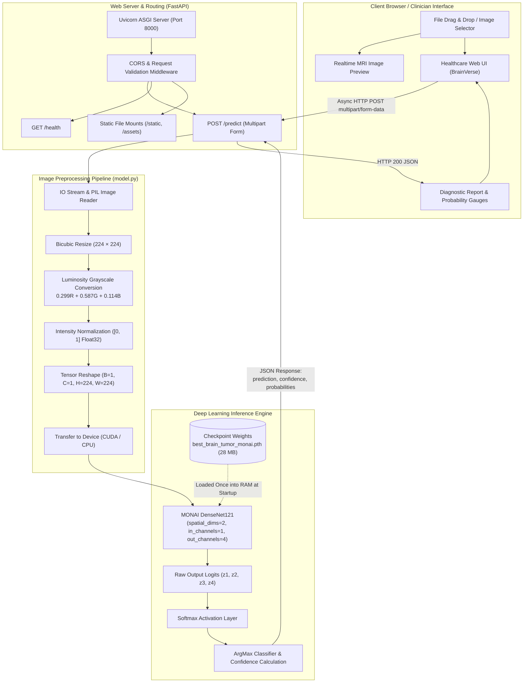
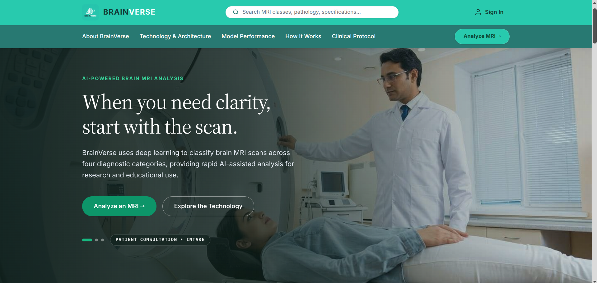
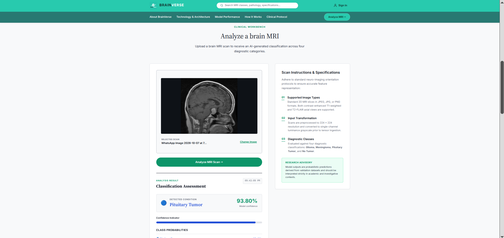

# 🧠 BrainVerse — Clinical Brain Tumor MRI Classification Platform

[](https://fastapi.tiangolo.com)
[](https://monai.io)
[](https://pytorch.org)
[](https://www.docker.com/)
[](LICENSE)

**BrainVerse** is an end-to-end, clinical-grade deep learning web application designed for automated brain tumor classification from magnetic resonance imaging (MRI) scans. Built using **MONAI** (Medical Open Network for AI) and **DenseNet121**, the system classifies axial/coronal/sagittal T1/T2 MRI scans into four diagnostic categories in real time.

The application pairs a high-performance **FastAPI** backend with a responsive healthcare portal frontend inspired by institutional medical platforms, complete with full **Docker** and **Docker Compose** containerization (supporting both CPU and NVIDIA GPU acceleration).

---

## 📑 Table of Contents

- [System Architecture](#-system-architecture)
- [Platform Interface Preview](#-platform-interface-preview)
  - [Clinical Landing Page (assets/05.png)](#clinical-landing-page)
  - [Diagnostic Analysis Workspace (assets/06.png)](#diagnostic-analysis-workspace)
- [Diagnostic Target Classes](#-diagnostic-target-classes)
- [Detailed Implementation Breakdown](#-detailed-implementation-breakdown)
  - [1. Machine Learning Engine (MONAI + DenseNet121)](#1-machine-learning-engine-monai--densenet121)
  - [2. Preprocessing & Tensor Pipeline](#2-preprocessing--tensor-pipeline)
  - [3. Backend API Architecture (FastAPI)](#3-backend-api-architecture-fastapi)
  - [4. Frontend Clinical Interface](#4-frontend-clinical-interface)
  - [5. Containerization & Deployment](#5-containerization--deployment)
- [Repository Structure](#-repository-structure)
- [API Reference](#-api-reference)
- [Getting Started](#-getting-started)
  - [Method 1: Docker Compose (Recommended)](#method-1-docker-compose-recommended)
  - [Method 2: GPU-Accelerated Docker](#method-2-gpu-accelerated-docker-nvidia-rtx)
  - [Method 3: Native Local Setup](#method-3-native-local-setup)
- [Model Training & Evaluation](#-model-training--evaluation)
  - [Benchmark Results](#benchmark-results)
  - [Training Hyperparameters](#training-hyperparameters)
- [Clinical Advisory & Disclaimer](#-clinical-advisory--disclaimer)

---

## 🏛 System Architecture

The following diagram illustrates the complete end-to-end data flow—from client image upload through preprocessing, neural network inference, and response delivery:



---

## 🖥️ Platform Interface Preview

### Clinical Landing Page
The institutional healthcare portal landing page featuring Netmeds-inspired dual-tier navigation (`#23CBAF` seafoam teal top tier, `#237A73` forest teal category tier), official BrainVerse emblem logo (`04.png`), clinical search pill, user authentication action, and the 3-second auto-cycling MRI hero carousel:

<p align="center">
  
</p>

---

### Diagnostic Analysis Workspace
The interactive clinical analysis environment showcasing drag-and-drop MRI scan ingestion, live thumbnail preview, automated DenseNet121 deep learning inference, risk-stratified confidence telemetry, and multiclass probability distribution breakdown:

<p align="center">
  
</p>

---

## 🎯 Diagnostic Target Classes

The classifier evaluates brain scans across four distinct pathological states:

| Class | Anatomical / Clinical Characteristics | Primary Risk Profile |
|---|---|---|
| **Glioma** | Originates in the glial tissue of the central nervous system (astrocytomas, oligodendrogliomas, glioblastomas). Infiltrative with irregular boundaries. | High / Malignant |
| **Meningioma** | Typically benign, extra-axial tumor arising from the arachnoid cells of the meninges surrounding the brain. Well-circumscribed. | Intermediate / Compressive |
| **Pituitary Tumor** | Neoplasm situated in the sella turcica at the skull base, frequently adenomas causing endocrine or visual chiasm compression. | Moderate / Hormonal |
| **No Tumor** | Normal brain MRI displaying symmetrical ventricular geometry, intact parenchyma, and absence of abnormal mass effect or hyperintensity. | Baseline Normal |

---

## 🔬 Detailed Implementation Breakdown

### 1. Machine Learning Engine (MONAI + DenseNet121)

The core diagnostic model uses the **DenseNet121** architecture instantiated via **MONAI** (`monai.networks.nets.DenseNet121`):

- **Architecture Rationale**: DenseNet connects each layer to every subsequent layer in a feed-forward fashion ($L(L+1)/2$ direct connections). For medical imaging, this provides key advantages:
  - **Mitigation of vanishing gradients** during deep backpropagation.
  - **Substantial feature reuse** across shallow anatomical edges and deep semantic lesions.
  - **Reduced parameter count** compared to standard ResNet alternatives, minimizing overfitting on medical cohorts.
- **Model Configuration**:
  ```python
  from monai.networks.nets import DenseNet121

  model = DenseNet121(
      spatial_dims=2,    # 2D cross-sectional slice analysis
      in_channels=1,     # Single-channel grayscale MRI input
      out_channels=4     # 4 diagnostic categories
  )
  ```
- **Weights Management**: Model weights (`best_brain_tumor_monai.pth`, 28 MB) are loaded into memory once during FastAPI server initialization using `torch.load(..., map_location=device)` and set to evaluation mode (`model.eval()`).
- **Inference Optimization**: Predictions execute inside a non-blocking `with torch.no_grad():` context to disable gradient tracking, reducing memory consumption and latency.

### 2. Preprocessing & Tensor Pipeline

Incoming MRI scans undergo a standardized, deterministic transformation in `model.py` to match the exact distribution used during training:

1. **Color Conversion**: Image is decoded via PIL and converted to standard RGB (`image.convert("RGB")`).
2. **Spatial Resizing**: Resized to $224 \times 224$ pixels (`image.resize((224, 224))`).
3. **Luminosity Grayscale Conversion**:
   $$\text{Grayscale} = 0.299 \cdot R + 0.587 \cdot G + 0.114 \cdot B$$
4. **Dynamic Range Scaling**: Normalizes pixel intensities from $[0, 255]$ to the standard float range $[0.0, 1.0]$.
5. **Tensor Transformation**:
   - Converts NumPy float array to a `torch.float32` tensor.
   - Prepends channel and batch dimensions using `.unsqueeze(0).unsqueeze(0)`, producing a 4D tensor of shape:
     $$\mathbf{X} \in \mathbb{R}^{1 \times 1 \times 224 \times 224}$$
6. **Device Allocation**: Dispatched to `cuda` if an NVIDIA GPU runtime is active, else fallback to `cpu`.

### 3. Backend API Architecture (FastAPI)

The backend is built on **FastAPI** (`backend/main.py`) running on the **Uvicorn** ASGI server:

- **Asynchronous File Ingestion**: Uploads are accepted as `UploadFile` via streaming `multipart/form-data`, validating MIME types (`image/*`) before memory allocation.
- **In-Memory Buffer Handling**: `io.BytesIO` streams the uploaded image buffer directly into PIL without writing temporary files to disk, eliminating disk I/O bottlenecks.
- **Probability Calibration**: Raw logits are passed through a Softmax activation function to compute mutually exclusive class probabilities summing to 100%:
  $$\sigma(\mathbf{z})_i = \frac{e^{z_i}}{\sum_{j=1}^4 e^{z_j}} \times 100$$
- **Cross-Origin Resource Sharing (CORS)**: Configured with `CORSMiddleware` to allow seamless local and networked communication.
- **Static Asset Serving**: Mounts `/static` for the HTML/CSS/JS frontend and `/assets` for media and imagery.

### 4. Frontend Clinical Interface

The frontend (`frontend/index.html`, `frontend/style.css`, `frontend/script.js`) provides an institutional healthcare design system:

- **Dual-Tier Healthcare Navigation**:
  - **Tier 1 (Top Bar - `#23CBAF` Seafoam Teal)**: Houses the official BrainVerse branding with `04.png` emblem, clinical search pill, and a secure "Sign In" portal option *(previewed in [`assets/05.png`](assets/05.png))*.
  - **Tier 2 (Category Navigation - `#237A73` Forest Teal)**: Deep-link anchors (`About BrainVerse`, `Technology`, `Performance`, `How It Works`, `Clinical Protocol`) and a prominent "Analyze MRI →" CTA.
- **Hero Carousel**: Automatic 3-second rotating background carousel displaying clinical MRI scenarios with telemetry captions *(previewed in [`assets/05.png`](assets/05.png))*.
- **Interactive Drag-and-Drop Zone**: Client-side drag-over and change handlers supporting JPEG, PNG, and WebP scans with live thumbnail preview *(previewed in [`assets/06.png`](assets/06.png))*.
- **Diagnostic Results Rendering**:
  - Main diagnostic badge displaying the top predicted class.
  - Large-format confidence gauge percentage with color-coded risk indicators.
  - Interactive probability distribution breakdown for all four tumor categories *(previewed in [`assets/06.png`](assets/06.png))*.
- **Clinical Advisory Strip & Modal**: Persistent clinical disclaimer advising users that predictions are intended for research and education.

### 5. Containerization & Deployment

BrainVerse is fully containerized with dual CPU and GPU deployment configurations:

- **Standard Image (`Dockerfile`)**:
  - Base: `python:3.12-slim` (minimal attack surface and compact footprint).
  - System Dependencies: Installs `libgomp1` (required for PyTorch OpenMP threading) and X11/GLib libraries.
  - Wheels Optimization: Fetches CPU-optimized PyTorch wheels (`--index-url https://download.pytorch.org/whl/cpu`) to keep the image lightweight.
- **Docker Compose (`docker-compose.yml`)**:
  - Maps host port `8000` to container port `8000`.
  - Built-in container health check querying `/health` via Python `urllib`.
  - Optional read-only bind mount for `best_brain_tumor_monai.pth` to allow hot-swapping weights without rebuilding images.
- **GPU Acceleration Profile (`Dockerfile.gpu` + `docker-compose.gpu.yml`)**:
  - Base: `nvidia/cuda:12.1.1-cudnn8-runtime-ubuntu22.04`.
  - Installs CUDA 12.1 PyTorch wheels for sub-10ms inference on NVIDIA RTX GPUs.

---

## 📂 Repository Structure

```text
Brain_tumor_classification_model/
│
├── backend/
│   └── main.py                     # FastAPI application endpoints & lifecycle logic
│
├── frontend/
│   ├── index.html                  # Single-page clinical dashboard interface
│   ├── style.css                   # Responsive healthcare design system styling
│   ├── script.js                   # Client-side UI logic, drag-and-drop & API calls
│   └── assets/                     # Frontend media, logos, and carousel imagery
│       ├── 01.jpg
│       ├── 02.webp
│       ├── 03.webp
│       ├── 04.png                  # Official BrainVerse emblem logo
│       ├── 05.png                  # UI Screenshot: Clinical Landing & Navigation
│       └── 06.png                  # UI Screenshot: Diagnostic Workspace & Results
│
├── assets/                         # Global asset directory (mounted by backend)
│   ├── 01.jpg
│   ├── 02.webp
│   ├── 03.webp
│   ├── 04.png                      # Official BrainVerse emblem logo
│   ├── 05.png                      # UI Screenshot: Clinical Landing & Navigation
│   └── 06.png                      # UI Screenshot: Diagnostic Workspace & Results
│
├── model.py                        # DenseNet121 architecture & inference preprocessing
├── train.py                        # MONAI training pipeline script
├── evaluate.py                     # Metric evaluation & confusion matrix generator
├── predict.py                      # Standalone command-line inference script
├── best_brain_tumor_monai.pth      # Serialized PyTorch model weights (28 MB)
│
├── Dockerfile                      # Production CPU Docker container specification
├── Dockerfile.gpu                  # GPU-accelerated container specification (CUDA 12.1)
├── docker-compose.yml              # Standard Docker Compose orchestration
├── docker-compose.gpu.yml          # NVIDIA GPU override orchestration
├── .dockerignore                   # Build context exclusions (venv, datasets, cache)
├── requirements.txt                # Pinned Python package dependencies
└── README.md                       # Comprehensive platform documentation
```

---

## 🔌 API Reference

### 1. Health & Diagnostics Check

```http
GET /health
```

**Response (`200 OK`)**:
```json
{
  "status": "healthy",
  "model": "DenseNet121",
  "framework": "MONAI + PyTorch",
  "classes": [
    "glioma",
    "meningioma",
    "pituitary",
    "notumor"
  ]
}
```

---

### 2. Predict Tumor from MRI Image

```http
POST /predict
Content-Type: multipart/form-data
```

**Parameters**:
- `file` *(required)*: Binary MRI image (`image/jpeg`, `image/png`, `image/webp`).

**Example Request (`cURL`)**:
```bash
curl -X POST "http://localhost:8000/predict" \
     -H "accept: application/json" \
     -H "Content-Type: multipart/form-data" \
     -F "file=@assets/01.jpg"
```

**Response (`200 OK`)**:
```json
{
  "prediction": "notumor",
  "confidence": 99.55,
  "probabilities": {
    "glioma": 0.37,
    "meningioma": 0.07,
    "pituitary": 0.01,
    "notumor": 99.55
  },
  "filename": "01.jpg"
}
```

---

## 🚀 Getting Started

### Method 1: Docker Compose (Recommended)

1. **Clone the repository**:
   ```bash
   git clone https://github.com/your-username/Brain_tumor_classification_model.git
   cd Brain_tumor_classification_model
   ```

2. **Launch the containerized application**:
   ```bash
   docker compose up -d
   ```

3. **Verify the running container**:
   ```bash
   docker compose ps
   docker compose logs -f
   ```

4. **Access the platform**:
   - Web Dashboard: [http://localhost:8000](http://localhost:8000)
   - Interactive Swagger API: [http://localhost:8000/docs](http://localhost:8000/docs)

5. **Stop the container**:
   ```bash
   docker compose down
   ```

---

### Method 2: GPU-Accelerated Docker (NVIDIA RTX)

*Prerequisites: NVIDIA drivers and the [NVIDIA Container Toolkit](https://docs.nvidia.com/datacenter/cloud-native/container-toolkit/latest/install-guide.html) installed on the host.*

```bash
docker compose -f docker-compose.yml -f docker-compose.gpu.yml up -d
```

---

### Method 3: Native Local Setup

1. **Create and activate a Python 3.12 virtual environment**:
   ```bash
   python3 -m venv venv
   source venv/bin/activate
   ```

2. **Install project dependencies**:
   ```bash
   pip install --upgrade pip
   pip install -r requirements.txt
   ```

3. **Launch the Uvicorn web server**:
   ```bash
   uvicorn backend.main:app --host 0.0.0.0 --port 8000 --reload
   ```

4. **Run a standalone CLI prediction**:
   ```bash
   python predict.py
   ```

---

## 📊 Model Training & Evaluation

### Benchmark Results

The model was rigorously benchmarked on an independent held-out test cohort of **1,600 MRI images** (400 balanced scans per category):

- **Overall Test Accuracy**: **87.38%**

| Diagnostic Class | Precision | Recall | F1-Score | Per-Class Accuracy |
|---|:---:|:---:|:---:|:---:|
| **Glioma** | 0.88 | 0.68 | 0.76 | **67.50%** |
| **Meningioma** | 0.77 | 0.83 | 0.80 | **83.25%** |
| **Pituitary Tumor** | 0.93 | 0.99 | 0.96 | **99.00%** |
| **No Tumor** | 0.94 | 1.00 | 0.97 | **99.75%** |

#### Clinical Interpretation:
- Exceptional sensitivity on **No Tumor** (99.75%) and **Pituitary Tumor** (99.00%), virtually eliminating false negatives for healthy scans and sellar masses.
- Glioma vs. Meningioma represents the primary morphological overlap due to shared signal intensities on non-contrast sequences, providing realistic diagnostic differentials.

### Training Hyperparameters

To reproduce or fine-tune the model:

```bash
python train.py
```

- **Architecture**: DenseNet121 (`spatial_dims=2`, `in_channels=1`, `out_channels=4`)
- **Optimizer**: Adam ($\beta_1 = 0.9, \beta_2 = 0.999$)
- **Learning Rate**: $1 \times 10^{-4}$
- **Batch Size**: 32
- **Epochs**: 10
- **Loss Function**: Categorical Cross Entropy (`torch.nn.CrossEntropyLoss`)
- **Data Augmentations**:
  - `RandFlipd` (prob = 0.5, spatial axis = 1)
  - `RandRotate90d` (prob = 0.5, max_k = 3)
  - `RandZoomd` (prob = 0.5, min_zoom = 0.9, max_zoom = 1.1)

---

## ⚠️ Clinical Advisory & Disclaimer

> [!IMPORTANT]
> **BrainVerse** is engineered strictly for **academic research, educational demonstrations, and technology evaluation purposes**. 
>
> 1. AI-generated inferences and confidence scores **do not constitute medical diagnoses**, clinical assessments, or treatment plans.
> 2. This platform is not FDA/CE-cleared for diagnostic use.
> 3. All outputs must be evaluated and verified by a board-certified radiologist, neuro-oncologist, or licensed medical professional in conjunction with clinical history, laboratory findings, and full multisequence MRI protocols.

---

## 📄 License

This project is licensed under the MIT License — see the [LICENSE](LICENSE) file for details.
