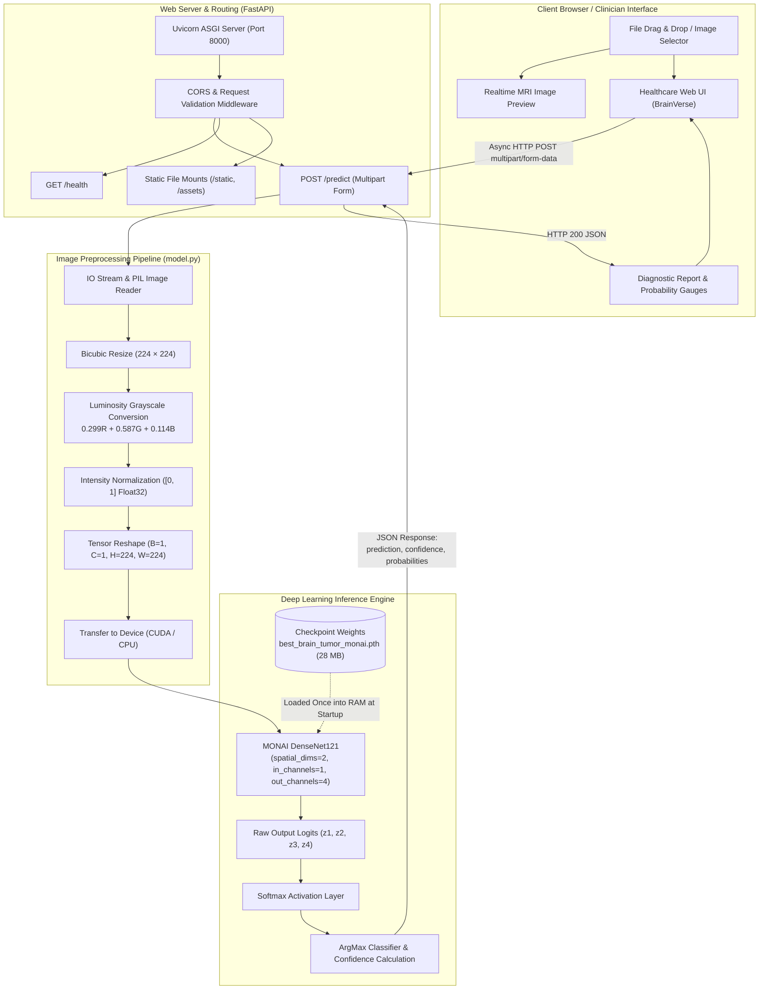
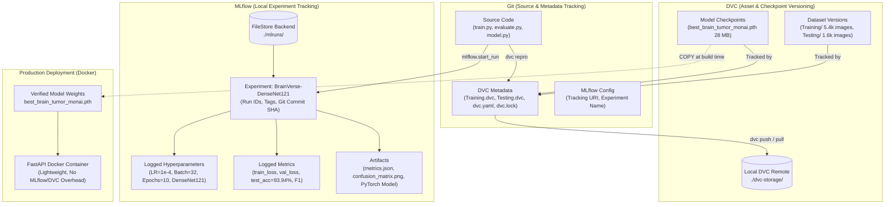

# 🧠 BrainVerse — Clinical Brain Tumor MRI Classification Platform

[](https://fastapi.tiangolo.com)
[](https://monai.io)
[](https://pytorch.org)
[](https://www.docker.com/)
[](LICENSE)

<p align="center">
  
</p>
<p align="center">
  
</p>

**BrainVerse** is an end-to-end, clinical-grade deep learning web application designed for automated brain tumor classification from magnetic resonance imaging (MRI) scans. Built using **MONAI** (Medical Open Network for AI) and **DenseNet121**, the system classifies axial/coronal/sagittal T1/T2 MRI scans into four diagnostic categories in real time.

The application pairs a high-performance **FastAPI** backend with a responsive healthcare portal frontend inspired by institutional medical platforms, complete with full **Docker** and **Docker Compose** containerization (supporting both CPU and NVIDIA GPU acceleration).

---

## 📑 Table of Contents

- [System Architecture](#-system-architecture)
- [Diagnostic Target Classes](#-diagnostic-target-classes)
- [Detailed Implementation Breakdown](#-detailed-implementation-breakdown)
  - [1. Machine Learning Engine (MONAI + DenseNet121)](#1-machine-learning-engine-monai--densenet121)
  - [2. Preprocessing & Tensor Pipeline](#2-preprocessing--tensor-pipeline)
  - [3. Backend API Architecture (FastAPI)](#3-backend-api-architecture-fastapi)
  - [4. Frontend Clinical Interface](#4-frontend-clinical-interface)
  - [5. Containerization & Deployment](#5-containerization--deployment)
- [Repository Structure](#-repository-structure)
- [API Reference](#-api-reference)
- [Getting Started](#-getting-started)
  - [Method 1: Docker Compose (Recommended)](#method-1-docker-compose-recommended)
  - [Method 2: GPU-Accelerated Docker](#method-2-gpu-accelerated-docker-nvidia-rtx)
  - [Method 3: Native Local Setup](#method-3-native-local-setup)
- [Model Training & Evaluation](#-model-training--evaluation)
  - [Benchmark Results](#benchmark-results)
  - [Training Hyperparameters](#training-hyperparameters)
- [MLOps & Experiment Tracking (DVC & MLflow)](#-mlops--experiment-tracking-dvc--mlflow)
  - [1. MLOps Architecture & Lineage Flow](#1-mlops-architecture--lineage-flow)
  - [2. Data & Model Versioning with DVC](#2-data--model-versioning-with-dvc)
  - [3. Reproducible Pipeline (dvc.yaml)](#3-reproducible-pipeline-dvcyaml)
  - [4. Local Experiment Tracking with MLflow](#4-local-experiment-tracking-with-mlflow)
  - [5. Visualizing & Comparing in MLflow UI](#5-visualizing--comparing-in-mlflow-ui)
  - [6. End-to-End Reproducibility Guide](#6-end-to-end-reproducibility-guide)
- [Clinical Advisory & Disclaimer](#-clinical-advisory--disclaimer)

---

## 🏛 System Architecture

The following diagram illustrates the complete end-to-end data flow—from client image upload through preprocessing, neural network inference, and response delivery:



---

## 🎯 Diagnostic Target Classes

The classifier evaluates brain scans across four distinct pathological states:

| Class | Anatomical / Clinical Characteristics | Primary Risk Profile |
|---|---|---|
| **Glioma** | Originates in the glial tissue of the central nervous system (astrocytomas, oligodendrogliomas, glioblastomas). Infiltrative with irregular boundaries. | High / Malignant |
| **Meningioma** | Typically benign, extra-axial tumor arising from the arachnoid cells of the meninges surrounding the brain. Well-circumscribed. | Intermediate / Compressive |
| **Pituitary Tumor** | Neoplasm situated in the sella turcica at the skull base, frequently adenomas causing endocrine or visual chiasm compression. | Moderate / Hormonal |
| **No Tumor** | Normal brain MRI displaying symmetrical ventricular geometry, intact parenchyma, and absence of abnormal mass effect or hyperintensity. | Baseline Normal |

---

## 🔬 Detailed Implementation Breakdown

### 1. Machine Learning Engine (MONAI + DenseNet121)

The core diagnostic model uses the **DenseNet121** architecture instantiated via **MONAI** (`monai.networks.nets.DenseNet121`):

- **Architecture Rationale**: DenseNet connects each layer to every subsequent layer in a feed-forward fashion ($L(L+1)/2$ direct connections). For medical imaging, this provides key advantages:
  - **Mitigation of vanishing gradients** during deep backpropagation.
  - **Substantial feature reuse** across shallow anatomical edges and deep semantic lesions.
  - **Reduced parameter count** compared to standard ResNet alternatives, minimizing overfitting on medical cohorts.
- **Model Configuration**:
  ```python
  from monai.networks.nets import DenseNet121

  model = DenseNet121(
      spatial_dims=2,    # 2D cross-sectional slice analysis
      in_channels=1,     # Single-channel grayscale MRI input
      out_channels=4     # 4 diagnostic categories
  )
  ```
- **Weights Management**: Model weights (`best_brain_tumor_monai.pth`, 28 MB) are loaded into memory once during FastAPI server initialization using `torch.load(..., map_location=device)` and set to evaluation mode (`model.eval()`).
- **Inference Optimization**: Predictions execute inside a non-blocking `with torch.no_grad():` context to disable gradient tracking, reducing memory consumption and latency.

### 2. Preprocessing & Tensor Pipeline

Incoming MRI scans undergo a standardized, deterministic transformation in `model.py` to match the exact distribution used during training:

1. **Color Conversion**: Image is decoded via PIL and converted to standard RGB (`image.convert("RGB")`).
2. **Spatial Resizing**: Resized to $224 \times 224$ pixels (`image.resize((224, 224))`).
3. **Luminosity Grayscale Conversion**:
   $$\text{Grayscale} = 0.299 \cdot R + 0.587 \cdot G + 0.114 \cdot B$$
4. **Dynamic Range Scaling**: Normalizes pixel intensities from $[0, 255]$ to the standard float range $[0.0, 1.0]$.
5. **Tensor Transformation**:
   - Converts NumPy float array to a `torch.float32` tensor.
   - Prepends channel and batch dimensions using `.unsqueeze(0).unsqueeze(0)`, producing a 4D tensor of shape:
     $$\mathbf{X} \in \mathbb{R}^{1 \times 1 \times 224 \times 224}$$
6. **Device Allocation**: Dispatched to `cuda` if an NVIDIA GPU runtime is active, else fallback to `cpu`.

### 3. Backend API Architecture (FastAPI)

The backend is built on **FastAPI** (`backend/main.py`) running on the **Uvicorn** ASGI server:

- **Asynchronous File Ingestion**: Uploads are accepted as `UploadFile` via streaming `multipart/form-data`, validating MIME types (`image/*`) before memory allocation.
- **In-Memory Buffer Handling**: `io.BytesIO` streams the uploaded image buffer directly into PIL without writing temporary files to disk, eliminating disk I/O bottlenecks.
- **Probability Calibration**: Raw logits are passed through a Softmax activation function to compute mutually exclusive class probabilities summing to 100%:
  $$\sigma(\mathbf{z})_i = \frac{e^{z_i}}{\sum_{j=1}^4 e^{z_j}} \times 100$$
- **Cross-Origin Resource Sharing (CORS)**: Configured with `CORSMiddleware` to allow seamless local and networked communication.
- **Static Asset Serving**: Mounts `/static` for the HTML/CSS/JS frontend and `/assets` for media and imagery.

### 4. Frontend Clinical Interface

The frontend (`frontend/index.html`, `frontend/style.css`, `frontend/script.js`) provides an institutional healthcare design system:

- **Dual-Tier Healthcare Navigation**:
  - **Tier 1 (Top Bar - `#23CBAF` Seafoam Teal)**: Houses the official BrainVerse branding with `04.png` emblem, clinical search pill, and a secure "Sign In" portal option *(previewed in [`assets/05.png`](assets/05.png))*.
  - **Tier 2 (Category Navigation - `#237A73` Forest Teal)**: Deep-link anchors (`About BrainVerse`, `Technology`, `Performance`, `How It Works`, `Clinical Protocol`) and a prominent "Analyze MRI →" CTA.
- **Hero Carousel**: Automatic 3-second rotating background carousel displaying clinical MRI scenarios with telemetry captions *(previewed in [`assets/05.png`](assets/05.png))*.
- **Interactive Drag-and-Drop Zone**: Client-side drag-over and change handlers supporting JPEG, PNG, and WebP scans with live thumbnail preview *(previewed in [`assets/06.png`](assets/06.png))*.
- **Diagnostic Results Rendering**:
  - Main diagnostic badge displaying the top predicted class.
  - Large-format confidence gauge percentage with color-coded risk indicators.
  - Interactive probability distribution breakdown for all four tumor categories *(previewed in [`assets/06.png`](assets/06.png))*.
- **Clinical Advisory Strip & Modal**: Persistent clinical disclaimer advising users that predictions are intended for research and education.

### 5. Containerization & Deployment

BrainVerse is fully containerized with dual CPU and GPU deployment configurations:

- **Standard Image (`Dockerfile`)**:
  - Base: `python:3.12-slim` (minimal attack surface and compact footprint).
  - System Dependencies: Installs `libgomp1` (required for PyTorch OpenMP threading) and X11/GLib libraries.
  - Wheels Optimization: Fetches CPU-optimized PyTorch wheels (`--index-url https://download.pytorch.org/whl/cpu`) to keep the image lightweight.
- **Docker Compose (`docker-compose.yml`)**:
  - Maps host port `8000` to container port `8000`.
  - Built-in container health check querying `/health` via Python `urllib`.
  - Optional read-only bind mount for `best_brain_tumor_monai.pth` to allow hot-swapping weights without rebuilding images.
- **GPU Acceleration Profile (`Dockerfile.gpu` + `docker-compose.gpu.yml`)**:
  - Base: `nvidia/cuda:12.1.1-cudnn8-runtime-ubuntu22.04`.
  - Installs CUDA 12.1 PyTorch wheels for sub-10ms inference on NVIDIA RTX GPUs.

---

## 📂 Repository Structure

```text
Brain_tumor_classification_model/
│
├── backend/
│   └── main.py                     # FastAPI application endpoints & lifecycle logic
│
├── frontend/
│   ├── index.html                  # Single-page clinical dashboard interface
│   ├── style.css                   # Responsive healthcare design system styling
│   ├── script.js                   # Client-side UI logic, drag-and-drop & API calls
│   └── assets/                     # Frontend media, logos, and carousel imagery
│       ├── 01.jpg
│       ├── 02.webp
│       ├── 03.webp
│       ├── 04.png                  # Official BrainVerse emblem logo
│       ├── 05.png                  # UI Screenshot: Clinical Landing & Navigation
│       └── 06.png                  # UI Screenshot: Diagnostic Workspace & Results
│
├── assets/                         # Global asset directory (mounted by backend)
│   ├── 01.jpg
│   ├── 02.webp
│   ├── 03.webp
│   ├── 04.png                      # Official BrainVerse emblem logo
│   ├── 05.png                      # UI Screenshot: Clinical Landing & Navigation
│   └── 06.png                      # UI Screenshot: Diagnostic Workspace & Results
│
├── model.py                        # DenseNet121 architecture & inference preprocessing
├── train.py                        # MONAI training pipeline script (integrated with MLflow)
├── evaluate.py                     # Metric evaluation, confusion matrix & MLflow tracking
├── predict.py                      # Standalone command-line inference script
├── best_brain_tumor_monai.pth      # PyTorch model weights (tracked via DVC cache)
│
├── dvc.yaml                        # DVC pipeline stages definition (train & evaluate)
├── dvc.lock                        # DVC reproducible pipeline lockfile with asset hashes
├── Training.dvc                    # DVC dataset tracking pointer for Training/
├── Testing.dvc                     # DVC dataset tracking pointer for Testing/
├── metrics.json                    # Machine-readable evaluation metrics (DVC metric)
├── confusion_matrix.png            # Visual confusion matrix plot (DVC & MLflow artifact)
├── mlruns/                         # Local MLflow file tracking backend (experiments/runs)
├── dvc-storage/                    # Local DVC remote storage directory
│
├── Dockerfile                      # Production CPU Docker container specification
├── Dockerfile.gpu                  # GPU-accelerated container specification (CUDA 12.1)
├── docker-compose.yml              # Standard Docker Compose orchestration
├── docker-compose.gpu.yml          # NVIDIA GPU override orchestration
├── .dockerignore                   # Build context exclusions (venv, datasets, cache)
├── requirements.txt                # Pinned dependencies (including MLflow & DVC)
└── README.md                       # Comprehensive platform documentation
```


---

## 🔌 API Reference

### 1. Health & Diagnostics Check

```http
GET /health
```

**Response (`200 OK`)**:
```json
{
  "status": "healthy",
  "model": "DenseNet121",
  "framework": "MONAI + PyTorch",
  "classes": [
    "glioma",
    "meningioma",
    "pituitary",
    "notumor"
  ]
}
```

---

### 2. Predict Tumor from MRI Image

```http
POST /predict
Content-Type: multipart/form-data
```

**Parameters**:
- `file` *(required)*: Binary MRI image (`image/jpeg`, `image/png`, `image/webp`).

**Example Request (`cURL`)**:
```bash
curl -X POST "http://localhost:8000/predict" \
     -H "accept: application/json" \
     -H "Content-Type: multipart/form-data" \
     -F "file=@assets/01.jpg"
```

**Response (`200 OK`)**:
```json
{
  "prediction": "notumor",
  "confidence": 99.55,
  "probabilities": {
    "glioma": 0.37,
    "meningioma": 0.07,
    "pituitary": 0.01,
    "notumor": 99.55
  },
  "filename": "01.jpg"
}
```

---

## 🚀 Getting Started

### Method 1: Docker Compose (Recommended)

1. **Clone the repository**:
   ```bash
   git clone https://github.com/your-username/Brain_tumor_classification_model.git
   cd Brain_tumor_classification_model
   ```

2. **Launch the containerized application**:
   ```bash
   docker compose up -d
   ```

3. **Verify the running container**:
   ```bash
   docker compose ps
   docker compose logs -f
   ```

4. **Access the platform**:
   - Web Dashboard: [http://localhost:8000](http://localhost:8000)
   - Interactive Swagger API: [http://localhost:8000/docs](http://localhost:8000/docs)

5. **Stop the container**:
   ```bash
   docker compose down
   ```

---

### Method 2: GPU-Accelerated Docker (NVIDIA RTX)

*Prerequisites: NVIDIA drivers and the [NVIDIA Container Toolkit](https://docs.nvidia.com/datacenter/cloud-native/container-toolkit/latest/install-guide.html) installed on the host.*

```bash
docker compose -f docker-compose.yml -f docker-compose.gpu.yml up -d
```

---

### Method 3: Native Local Setup

1. **Create and activate a Python 3.12 virtual environment**:
   ```bash
   python3 -m venv venv
   source venv/bin/activate
   ```

2. **Install project dependencies**:
   ```bash
   pip install --upgrade pip
   pip install -r requirements.txt
   ```

3. **Launch the Uvicorn web server**:
   ```bash
   uvicorn backend.main:app --host 0.0.0.0 --port 8000 --reload
   ```

4. **Run a standalone CLI prediction**:
   ```bash
   python predict.py
   ```

---

## 📊 Model Training & Evaluation

### Benchmark Results

The model was rigorously benchmarked on an independent held-out test cohort of **1,600 MRI images** (400 balanced scans per category):

- **Overall Test Accuracy**: **93.94%** (1,503 / 1,600 correct predictions)
- **Macro Precision**: **0.9398** | **Macro Recall**: **0.9394** | **Macro F1-Score**: **0.9390**

| Diagnostic Class | Precision | Recall | F1-Score | Per-Class Accuracy | Correct / Total |
|---|:---:|:---:|:---:|:---:|:---:|
| **Glioma** | 0.9005 | 0.8825 | 0.8914 | **88.25%** | 353 / 400 |
| **Meningioma** | 0.9450 | 0.9025 | 0.9233 | **90.25%** | 361 / 400 |
| **Pituitary Tumor** | 0.9898 | 0.9725 | 0.9811 | **97.25%** | 389 / 400 |
| **No Tumor** | 0.9238 | 1.0000 | 0.9604 | **100.00%** | 400 / 400 |

#### Confusion Matrix:

```text
Actual \ Predicted      glioma    meningioma     pituitary       notumor
glioma                     353            19             1            27
meningioma                  30           361             3             6
pituitary                    9             2           389             0
notumor                      0             0             0           400
```

#### Clinical Interpretation:
- **Zero False Negatives for Healthy Brain Scans**: The classifier achieved 100.00% recall on **No Tumor** (400/400 correctly identified), ensuring non-pathological scans are never erroneously identified as tumors.
- **Superior Pituitary Accuracy**: 97.25% accuracy and 0.9811 F1-score for sellar/pituitary masses with clean differentiation from supratentorial lesions.
- **Glioma vs. Meningioma Differential**: Meningioma achieved 90.25% accuracy and Glioma 88.25%, with the primary false positives mirroring the standard radiological differential on non-contrast imaging.

### Training Hyperparameters

To reproduce or fine-tune the model:

```bash
python train.py
```

- **Architecture**: DenseNet121 (`spatial_dims=2`, `in_channels=1`, `out_channels=4`)
- **Optimizer**: Adam ($\beta_1 = 0.9, \beta_2 = 0.999$)
- **Learning Rate**: $1 \times 10^{-4}$
- **Batch Size**: 32
- **Epochs**: 10
- **Loss Function**: Categorical Cross Entropy (`torch.nn.CrossEntropyLoss`)
- **Data Augmentations**:
  - `RandFlipd` (prob = 0.5, spatial axis = 1)
  - `RandRotate90d` (prob = 0.5, max_k = 3)
  - `RandZoomd` (prob = 0.5, min_zoom = 0.9, max_zoom = 1.1)

---

## 🔄 MLOps & Experiment Tracking (DVC & MLflow)

BrainVerse integrates a **local-first MLOps lifecycle** combining **DVC** (Data Version Control) for dataset and model weight versioning with **MLflow** for experiment tracking, parameter logging, metric visualization, and model registry artifacts.

This setup guarantees **100% reproducibility** while keeping the production Docker deployment lightweight and decoupled.

### 1. MLOps Architecture & Lineage Flow



---

### 2. Data & Model Versioning with DVC

Git tracks code and light metadata, while **DVC** handles large MRI datasets and PyTorch `.pth` binary checkpoints without bloating Git history.

#### Local DVC Remote Setup

BrainVerse uses a dedicated local DVC remote storage directory:

```bash
# Initialize DVC within the repository
dvc init

# Create and configure the local remote storage
mkdir -p dvc-storage
dvc remote add -d local_storage ./dvc-storage
```

#### Tracking Datasets

The raw training and testing directories are tracked with DVC pointers:

```bash
# Track datasets with DVC
dvc add Training
dvc add Testing

# Commit DVC metadata to Git
git add Training.dvc Testing.dvc .gitignore
git commit -m "chore: track Training and Testing MRI datasets with DVC"
```

#### Everyday DVC Lifecycle Commands

```bash
# Push tracked data and model artifacts to local remote
dvc push

# Pull datasets/models on a fresh clone or new environment
dvc pull

# Synchronize working directory to currently checked-out Git commit
dvc checkout

# Inspect synchronization status of datasets and pipeline stages
dvc status
```

---

### 3. Reproducible Pipeline (`dvc.yaml`)

The training and evaluation pipeline is defined declaratively in [`dvc.yaml`](dvc.yaml), enabling automated dependency checking and end-to-end reproducibility:

```yaml
stages:
  train:
    cmd: python train.py
    deps:
      - Training
      - model.py
      - train.py
    outs:
      - best_brain_tumor_monai.pth
  evaluate:
    cmd: python evaluate.py
    deps:
      - Testing
      - best_brain_tumor_monai.pth
      - evaluate.py
      - model.py
    metrics:
      - metrics.json:
          cache: false
    plots:
      - confusion_matrix.png:
          cache: false
```

#### Reproducing Pipeline Stages

```bash
# Reproduce entire pipeline (re-trains and re-evaluates only if dependencies changed)
dvc repro

# Reproduce only the evaluation stage against current model weights
dvc repro evaluate

# View tabular metrics comparison
dvc metrics show

# View plot artifacts
dvc plots show
```

The pipeline writes machine-readable evaluation results directly to [`metrics.json`](metrics.json) and generates a high-resolution confusion matrix plot at [`confusion_matrix.png`](confusion_matrix.png).

---

### 4. Local Experiment Tracking with MLflow

Both [`train.py`](train.py) and [`evaluate.py`](evaluate.py) are instrumented with **MLflow** using a local file-based tracking store (`file:./mlruns`) under the unified experiment name **`BrainVerse-DenseNet121`**.

#### Configuration

In both scripts, tracking is configured automatically:

```python
import os
import mlflow

os.environ.setdefault("MLFLOW_ALLOW_FILE_STORE", "true")
os.environ.setdefault("MLFLOW_DISABLE_AGENT_HINT", "1")

MLFLOW_TRACKING_URI = os.getenv("MLFLOW_TRACKING_URI", "file:./mlruns")
EXPERIMENT_NAME = os.getenv("MLFLOW_EXPERIMENT_NAME", "BrainVerse-DenseNet121")

mlflow.set_tracking_uri(MLFLOW_TRACKING_URI)
mlflow.set_experiment(EXPERIMENT_NAME)
```

#### What MLflow Logs

| Category | Items Logged | Description |
|---|---|---|
| **Tags** | `git_commit`, `model_architecture`, `framework`, `stage` | Traceability back to exact Git commit SHA |
| **Parameters** | `architecture`, `spatial_dims`, `in_channels`, `out_channels`, `learning_rate`, `batch_size`, `epochs`, `optimizer`, `loss_function`, `augmentations` | Exact hyperparameters for complete reproduction |
| **Epoch Metrics** | `train_loss`, `train_accuracy`, `val_loss`, `val_accuracy` | Step-by-step training curves per epoch |
| **Evaluation Metrics** | `test_accuracy`, `precision_macro`, `recall_macro`, `f1_macro`, per-class precision/recall/F1/accuracy | Standardized test cohort benchmark results |
| **Artifacts** | `metrics.json`, `confusion_matrix.png`, `best_brain_tumor_monai.pth`, MLflow model flavor (`model/`) | Visual charts, structured JSON data, and model weights |

---

### 5. Visualizing & Comparing in MLflow UI

Launch the local MLflow web dashboard to explore training runs, compare hyperparameter experiments, and inspect metric curves:

```bash
# Launch MLflow UI on localhost:5000
mlflow ui --port 5000
```

Open **`http://127.0.0.1:5000`** in your browser to:

1. **Compare Runs**: Select multiple training runs side-by-side to evaluate learning rates, batch sizes, and validation accuracy.
2. **Interactive Curves**: Inspect interactive loss convergence and accuracy graphs across epochs.
3. **Artifact Explorer**: Preview the generated `confusion_matrix.png`, download `metrics.json`, and inspect the serialized PyTorch model artifacts.
4. **Git Lineage**: Click on the `git_commit` tag to correlate any model artifact with the exact source code revision that generated it.

---

### 6. End-to-End Reproducibility Guide

The following table summarizes how each layer of BrainVerse maintains traceability:

```text
┌─────────────────┐       ┌─────────────────┐       ┌─────────────────┐       ┌─────────────────┐
│   Git Commit    │ ----> │    DVC Data     │ ----> │   MLflow Run    │ ----> │  Docker Deploy  │
│      Hash       │       │      Hash       │       │       ID        │       │    Container    │
├─────────────────┤       ├─────────────────┤       ├─────────────────┤       ├─────────────────┤
│ Tracks code and │       │ Locks exact MRI │       │ Records exact   │       │ Packages frozen │
│ pipeline DAG in │       │ data versions & │       │ params, loss    │       │ weights into    │
│ dvc.yaml        │       │ weights in lock │       │ curves, metrics │       │ production API  │
└─────────────────┘       └─────────────────┘       └─────────────────┘       └─────────────────┘
```

#### Step-by-Step Reproduction Checklist

```bash
# 1. Clone the repository and checkout target commit
git checkout <commit-hash>

# 2. Pull dataset and model weights from local DVC storage
dvc pull

# 3. Reproduce evaluation or training pipeline
dvc repro

# 4. View results
dvc metrics show
mlflow ui --port 5000

# 5. Build and launch production Docker container
docker compose up -d --build
```


---

## ⚠️ Clinical Advisory & Disclaimer

> [!IMPORTANT]
> **BrainVerse** is engineered strictly for **academic research, educational demonstrations, and technology evaluation purposes**. 
>
> 1. AI-generated inferences and confidence scores **do not constitute medical diagnoses**, clinical assessments, or treatment plans.
> 2. This platform is not FDA/CE-cleared for diagnostic use.
> 3. All outputs must be evaluated and verified by a board-certified radiologist, neuro-oncologist, or licensed medical professional in conjunction with clinical history, laboratory findings, and full multisequence MRI protocols.

---

## 📄 License

This project is licensed under the MIT License — see the [LICENSE](LICENSE) file for details.
